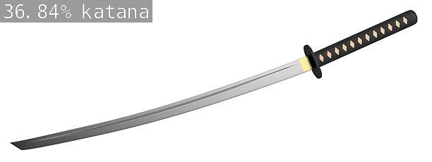

# Sword classification project

 I am using image classification to sort different photos of sword into their respected classification. the inspiration behind this project is my knowledge and hyperfixation on smithing and fencing. I myself am a Game Master for multiple TTRPG's (Tabletop roleplaying games like for example: Dungeons and dragons, Pathfinder, etc..), and how I thought it could be useful is for people who are getting into that kinda stuff and don't already have much knowledge about fantasy weapons.

## The Algorithm

I am using image classification and feeding images of different types of swords into the resnet 18 model using transfer learning. The reasoning behind the use of transfer learning is because it would be way too time consuming to make our own model from scratch. 

## Running this project

1. imagenet.py --model=resnet18.onnx --input_blob=input_0 --output_blob=output_0 --labels=labels.txt katana.jpg output.jpg
2. https://github.com/dusty-nv/jetson-inference/blob/master/docs/building-repo-2.md.

[View a video explanation here](video link)
